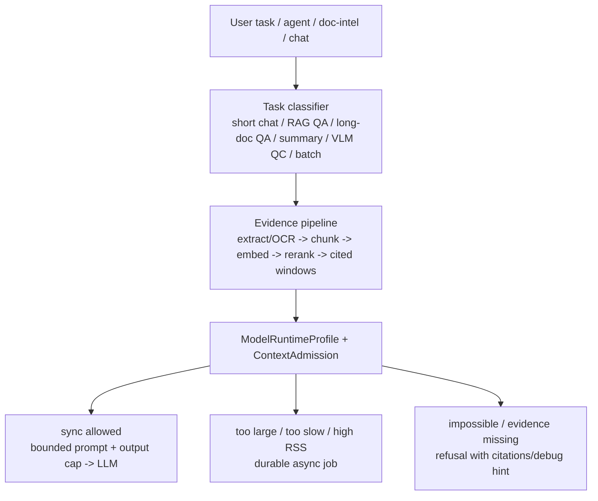
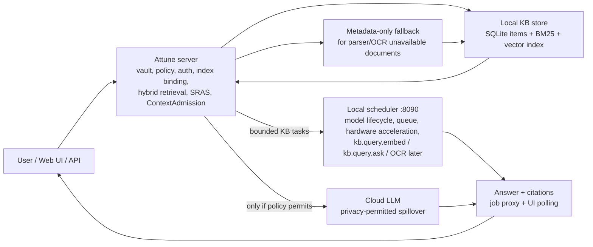

# local scheduler / Cloud LLM Long-Context Architecture Adjustment Plan

> Date: 2026-07-07  
> Scope: architecture plan plus S1-S6 local scheduler chat pilot grounding.  
> Sources: `/data/company/project/vlm-llm-benchmark/reports/local-scheduler-riscv-32g.en.md`,
> `/data/company/project/vlm-llm-benchmark/docs/local-scheduler-source-runtime-and-long-context.md`,
> Attune `context_budget`, `context_compress`, chat route, ModelStack/local scheduler specs.
> Implementation note: Attune now uses scheduler-native `/models` +
> `/capacity` + `/benchmark/contract`; do not treat local scheduler as a generic `/v1/*`
> OpenAI-compatible endpoint. `RuntimeProfileResolver` and pure
> `ContextAdmission`, KB task adapter, and SRAS/index-partition planner cores
> exist. local scheduler chat retrieval planning, public search retrieval planning,
> scheduler-native `kb.query.ask` answer submission, server job proxy routes,
> and front-end async-job polling/status UI are wired; document route wiring is
> still pending.

## 1. Current Finding

`vlm-llm-benchmark` has moved beyond generic model throughput: the local scheduler 32G report now gives enough evidence to set product rules for long text.

Key results:

- local scheduler 32G can run `Qwen3-30B-A3B-Q4_0` as the best local LLM, but only for bounded prompts. The realistic 1K retest took 223.834s and about 30.488GiB RSS. 3K sync was manually aborted. 32K is impractical.
- Aviation manual long-context cases are valid product-like material. A 1K `Qwen3-4B-Q4_0` window passed quality but took 175.453s. A 3K sync request exceeded 5 minutes before cancellation.
- `Qwen3-0.6B-Q4_0` with conservative safety windows avoided context-overflow HTTP errors, but quality failed with score 0.5958. Stable calls are not the same as acceptable answers.
- Character-count clipping undercounted serving tokens in at least one local scheduler aviation run, producing context overflow. A safety factor stopped 400s but removed too much evidence.
- The raw model-server tests did not exercise scheduler/gateway behavior: queue wait, admission, cancellation, TTL, memory guard, and backpressure remain unproven.

Conclusion: the failure mode is not "long context unsupported" in a narrow sense. It is a missing product-level admission and context orchestration layer. Nominal model metadata must not be treated as usable interactive context.

## 2. Current Attune Gap

Attune already has useful pieces:

- `context_budget::plan_context()` trims history and RAG budget by model name.
- `context_compress` can summarize chunks and cache summaries.
- `deep_summary` has map-reduce and token-bill machinery.
- local scheduler profile/scheduler specs already aim to collect local inference behind one endpoint.

The gaps exposed by local scheduler long-context results:

- `context_budget::context_window()` maps all `qwen` / `llama` models to 32K. For local scheduler 30B this is unsafe: tested sync context should be closer to 1K for interactive paths, with 3K+ async-only.
- The budget planner only sees `model_name`, not endpoint, runtime, configured `n_ctx`, prefill TPS, memory limit, or whether the request should be sync/async.
- The final `/chat` request is not re-admitted after prompt assembly. Search budget is allocated before compression, memory assembly, web fallback, PII redaction, and system prompt formatting.
- Free-form chat currently calls the governor with default `LlmCallOptions`, so there is no universal output token cap for slow local models.
- Long-document handling is split by feature. Chat, doc-intel, VLM, and benchmark eval can each build prompts differently; the guardrail must be shared.
- The local scheduler transport, runtime-profile core, ContextAdmission, KB task adapter, and SRAS/index-partition planner now exist. local scheduler chat and public search use the planner for bounded evidence retrieval, local scheduler chat answer generation submits `kb.query.ask`, and async chat jobs are polled/displayed in the front end. Document intelligence flows are not yet wired to scheduler-native task submission end-to-end.

## 3. Target Architecture

Add a model-runtime planning layer between retrieval/document pipelines and `LlmProvider` calls.



This must apply to both cloud LLMs and local scheduler models. Cloud models have larger envelopes, but still need cost, citation, and latency control. Local scheduler models have much tighter sync envelopes and stricter memory admission.

### 2026-07-09 Architecture After the X100 Pilot

The 48-document airplane-manual run on `192.168.100.140` turned the target
architecture into a concrete split:



Key boundary decision: Attune should not call llama.cpp, ORT, OCR, ASR, rerank,
or model-worker runtimes directly in the scheduler-runtime build. Attune owns
policy, storage, retrieval planning, context admission, citation assembly, and
cloud/local routing. The scheduler owns model residency, queueing, hardware
acceleration, and worker-specific acceleration on X100, Windows high-performance
hosts, and Linux x86 high-performance hosts.

The pilot also confirmed that long-context failure is not solved by a larger
context window. Even with a hypothetical 1M window, whole-manual prompting would
still suffer from attenuation, latency, citation drift, and cost. The effective
path is metadata/partition narrowing, hybrid retrieval, source-aware SRAS
selection, and a small cited evidence packet.

### Answer Worker Quality Strategy

The local scheduler answer path now has two layers:

- High-confidence local KB source lookup and operational-safety questions can
  return a synchronous extractive answer directly from retrieved evidence. This
  avoids prompt prefill and generation latency, reports the request as local and
  cached in the cost surface, and keeps citations attached.
- Open-ended synthesis, complex reasoning, or lower-confidence evidence still
  goes through scheduler-native `kb.query.ask` with bounded contexts and an
  explicit `answer_policy` asking for grounded cited answers, source terms, and
  refusal of real flight or maintenance procedure steps.

The refusal template is product-owned in Attune for safety-critical aviation
queries: it must not provide exact real-flight or maintenance emergency steps,
must tell the user not to use the answer for operational decisions, and must
point to official manuals / qualified crew or maintenance personnel. This rule
applies equally to X100, future Windows high-performance hosts, Linux x86 hosts,
and cloud fallback.

Latency gate target: the full airplane-manual API/Web suite should remain below
10s p95 for simple local KB queries once retrieval already hit the correct
source. Any query that needs longer generation should be classified as async or
cloud-eligible by policy rather than expanding the local prompt.

## 4. New Core Concepts

### ModelRuntimeProfile

Resolved from ModelStack/catalog, settings, and optional scheduler health:

```text
model_id
provider_kind
endpoint
is_local
nominal_context_tokens
tested_sync_input_tokens
tested_async_input_tokens
recommended_output_tokens
tested_sync_input_tokens
tested_async_input_tokens
prefill_tps
decode_tps
rss_base_mb
rss_per_1k_input_mb
max_concurrency
requires_queue_for_long_context
supports_tokenize
supports_prompt_cache
quality_tier
```

For local scheduler 32G, the initial profile encodes:

- `Qwen3-30B-A3B-Q4_0` / scheduler `llm-chat`: sync short prompts only; current product sync cap 1024 tokens even though scheduler hard sync cap is 4096; long context async/cloud after policy.
- `Qwen3.5-35B-A3B-Q4_0`: API/perf control; not default until full quality matrix.
- `Qwen3-4B-Q4_0`: triage/smoke; sync 1K still not interactive by UX standards.
- `Qwen3-0.6B-Q4_0`: pipeline smoke only, not answer quality.
- VLM `Qwen3.5-2B`: sync practical default.
- VLM `Qwen3VL-4B + mmproj`: async quality-control model.

### ContextAdmission

A single preflight that every LLM/VLM text call must pass.

Inputs:

- task type and user-visible latency class
- final assembled messages, not only user query
- desired answer cap
- `ModelRuntimeProfile`
- privacy tier and local/cloud destination
- current queue/memory state if available

Outputs:

```text
AdmitSync {
  messages,
  max_output_tokens,
  estimated_input_tokens,
  estimated_latency_s,
  citations_required
}

RouteAsync {
  job_kind,
  reason,
  ttl,
  cancellation_supported
}

RejectOrRefuse {
  code,
  user_message,
  developer_hint
}
```

Hard rules:

- Never send a whole long document/manual directly to LLM.
- Never rely on character clipping alone when near a runtime limit.
- Always reserve output tokens.
- Re-run admission after context compression and final prompt formatting.
- If evidence windows do not contain the answer, refuse or ask for narrower input rather than stretching the window blindly.

### Token Counting Strategy

Priority order:

1. Scheduler/provider tokenizer endpoint, e.g. `POST /tokenize` or a local scheduler metadata route.
2. Local tokenizer for known GGUF/tokenizer artifacts.
3. Calibrated conservative estimator from `vlm-llm-benchmark` profile.

The current heuristic remains useful for UI cost estimates, but admission needs a stricter path.

## 5. Long-Text Product Path

Long documents should follow the same pipeline on cloud and local scheduler:

1. Offline extract PDF/text/OCR with page and span metadata.
2. Chunk semantically, preserving section/page boundaries and stable chunk IDs.
3. Embed locally where possible.
4. Retrieve top candidates.
5. Rerank only when the latency profile allows it. Local/edge interactive chat
   defaults to RRF order and does not wait on scheduler rerank; enable rerank
   explicitly for offline search, quality audits, or high-quality async modes.
6. Build answer-centered evidence windows around retrieved chunks/spans.
7. Use tokenizer-aware adaptive shrinking until the final message fits the profile.
8. Require citations/page refs in the answer.
9. Route large synthesis/verification to durable async jobs with TTL, cancellation, and queue status.

This makes cloud and local behavior consistent: cloud can admit larger windows or reduce fewer times, but it still receives cited windows instead of raw whole documents.

## 6. Local Scheduler Contract Status

The inspected local scheduler is scheduler-native, not primarily OpenAI-compatible.
Attune should use the current implemented surface:

- `GET /benchmark/contract`: model/runtime contract, context/output caps, service classes, runtime tasks, async job limits.
- `GET /models`: per-model `state`, lifecycle, queue depth/capacity, latency samples.
- `GET /capacity`: cluster/resource/memory snapshot; not a model-scoped capacity API.
- `POST /kb/tasks/{task}` and `POST /kb/tasks/{task}:async`: application-facing local KB tasks.
- `GET /jobs/{job_id}` and cancel routes: async local job lifecycle.

Important absences in the current scheduler:

- No `GET /capacity?model=...` schema returning `{state, eta_ms, mem_headroom_mb}`.
- No public `/v1/*` route registered in `src/routes.cpp`.
- No `/tokenize` or `/admit` endpoint yet.

Therefore Attune must derive model capacity from `/models` + `/capacity`, seed
runtime caps from `/benchmark/contract`, and perform tokenizer-aware
ContextAdmission itself. `/tokenize` and `/admit` remain useful future scheduler
extensions, but the local scheduler pilot must not depend on them.

## 7. Attune Implementation Slices

S1. Runtime profile schema

- Add model runtime fields to catalog/profile data.
- Seed local scheduler 32G values from the 2026-07-07 benchmark report.
- Keep existing model selection behavior as fallback.

S2. ContextAdmission core module

- New `attune-core::context_admission`.
- Accept final messages plus `ModelRuntimeProfile`.
- Return sync/async/reject decision.
- Unit tests for local scheduler 30B 1K/3K/32K, cloud 128K, unknown model fallback, and CJK/English mixed text.

S3. Chat route integration

- Replace direct `plan_context(model_name, ...)` usage with profile-aware planning.
- Re-admit after final system prompt assembly.
- Set `LlmCallOptions.max_tokens` for all governed chat calls.
- Surface admission metadata in `cost_estimate` / eval trace.

S4. Long-document orchestrator

- Share evidence-window builder between chat, doc-intel, writing, and eval.
- Use existing `deep_summary` for async map-reduce, but route via durable jobs.
- Add refusal behavior when evidence is missing.

S5. local scheduler/capacity integration

- Probe `/benchmark/contract`, `/models`, `/capacity`, and optional future `/tokenize`.
- If absent, use static profile with conservative safety factor.
- Add queue/memory reason codes to UI and logs.

S6. Bench validation

- Extend `kb_longloop` from ingest/search-only to include bounded `/chat` questions.
- Add local scheduler long-context acceptance cases:
  - 1K cited window admitted only as async if expected latency exceeds UX threshold.
  - 3K direct prompt never admitted sync on local scheduler 30B.
  - Tokenizer undercount regression: conservative or exact count prevents HTTP 400 overflow.
  - Cloud path still avoids whole-document prompt and reports cost.

## 8. Acceptance Gates

- local scheduler 30B cannot receive a direct 3K+ sync prompt through production chat/doc-intel paths.
- Every LLM call has an input estimate, output cap, admission decision, and telemetry reason.
- Cloud and local paths use the same evidence-window contract.
- Long-document QA returns cited answers or explicit refusal; no silent whole-document truncation.
- Scheduler unavailable degrades safely: no panic, no hidden cloud fallback for L0, and clear UI status.
- Benchmark artifacts can regenerate the runtime profile or at least fail CI when local scheduler numbers are older than the accepted calibration window.

Implementation status: S1-S5 now provide the core building blocks, and S6 has
started with local scheduler chat retrieval planning, public search retrieval planning,
`kb.query.ask` submission, server job proxy routes, and front-end polling/status
UI. The
remaining risk is route-level composition outside chat: document intelligence
still needs to assemble cited evidence packets, pass ContextAdmission, and
submit local scheduler KB tasks where answer generation is required.

## 9. Immediate Recommendation

Treat local scheduler 32G local 30B as a high-quality bounded/async model, not as an interactive long-context model. The product default for long documents should be retrieval-windowed RAG plus async verifier. Cloud LLMs may be faster and larger, but they should go through the same mechanism so cost, privacy, citations, and failure behavior remain predictable.

## 10. Edge-Native Retrieval Addendum

### Current RVV Status

Attune's production vector database path is currently `usearch` HNSW with F16 quantization:

- `attune-core/src/vectors.rs`
- `attune-core/src/memory/retrieval.rs`

There is no explicit Attune-side RVV switch, compile flag, or local-scheduler-specific vector-index dispatch in this path today. The existing local scheduler RVV/IME work is documented for ORT and ggml inference:

- embedding / reranker / OCR through ORT RVV or IME kernels
- ASR / LLM through ggml or scheduler paths

That means local scheduler can have optimized embedding and reranking inference while the vector index itself remains the generic `usearch` path. This is acceptable only if vector search is not the bottleneck. It should be measured separately from embedding/rerank/model-server latency.

Required follow-up:

- Add a local scheduler vector-index microbench: insert throughput, HNSW search p50/p95/p99, RSS, and recall under realistic dimensions and corpus sizes.
- Record whether the shipped `usearch` binary is scalar, auto-vectorized, or RVV-enabled.
- If vector search becomes material, either build an RVV-enabled `usearch` artifact for riscv64 or move vector search behind a local scheduler retrieval service with an explicit capability report.

### SRAS: Score/Reward/Risk/Resource-Aware Selector

Interpretation: SRAS is the coefficient-reward-aware selector that chooses the cheapest retrieval plan likely to answer the query correctly.

SRAS should sit after query analysis and before retrieval fan-out:

```text
query
  -> query features
  -> SRAS selector
  -> retrieval plan: partitions + channels + candidate counts + rerank tier
  -> evidence windows
  -> ContextAdmission
```

A first practical scoring function:

```text
utility(plan) =
  + w_recall       * expected_recall
  + w_precision    * expected_precision
  + w_citation     * citation_coverage
  + w_freshness    * freshness_fit
  + w_locality     * local_success_probability
  - w_latency      * estimated_latency_ms
  - w_memory       * estimated_rss_mb
  - w_token        * estimated_llm_tokens
  - w_privacy      * cloud_or_cross_tier_risk
  - w_timeout      * timeout_probability
```

The output is a retrieval plan, not just a score:

```text
RetrievalPlan {
  partitions,
  channels: bm25 | vector | entity | metadata | summary | graph,
  initial_k_by_channel,
  fusion,
  rerank_kind,
  rerank_k,
  evidence_budget_tokens,
  allow_llm_rewrite,
  local_only,
  escalation_policy
}
```

local scheduler defaults should bias toward deterministic/local channels:

- exact metadata and entity lookup first
- BM25 + vector hybrid for normal KB questions
- BGE reranker only on a bounded candidate set, initially `top_k <= 20`
- local small/medium LLM only for query rewrite or answer synthesis when evidence is already strong
- 30B local model for bounded final synthesis, verification, or async quality checks
- cloud only when privacy permits and SRAS predicts local evidence/model path is insufficient

### Heterogeneous Index Partitioning

Assumption: "easy index partitioning" means heterogeneous index partitioning.

Partitioning should be logical first, physical only where it improves latency or memory:

```text
partition_key =
  vault_id
  + corpus_domain
  + privacy_tier
  + modality
  + language
  + source_type
  + time_bucket
  + embedding_model_id
  + vector_dim
```

Recommended partition types:

- Hot working set: recent files, pinned projects, active chat/project scope.
- Domain partitions: legal, medical, tech, finance, general. Existing `corpus_domain` can seed this.
- Privacy partitions: L0 local-only content must never be mixed into cloud-bound context.
- Modality partitions: text, OCR text, table, chart, image/VLM-derived captions, ASR transcript.
- Granularity partitions: section summaries, paragraph chunks, entity facts, full text.
- Language partitions: zh/en/mixed to reduce cross-language pollution before scoring.
- Memory partitions: raw chunks, L1 summaries, L2 episodic memories, L3 semantic clusters.

SRAS chooses partitions before expensive work. This prevents a generic query from scanning all vaults and prevents a domain query from being polluted by unrelated high-frequency terms.

### Avoiding Long-Context Attenuation

Even a 1M-token window does not remove long-text failure:

- middle-position evidence is still easy to ignore
- many near-duplicate facts dilute the signal
- conflicting evidence needs explicit resolution, not more tokens
- long context increases latency, cost, and failure surface
- citations become less reliable when the model sees broad raw context

The product rule should be: large context is a fallback capacity, not the primary retrieval strategy.

Use anti-attenuation controls:

- query-focused evidence windows, not whole documents
- hierarchical retrieval: document -> section -> paragraph/span
- extractive anchors with page/span IDs before abstractive synthesis
- diversity-aware packing so one document cannot consume the whole budget
- contradiction clustering before final answer
- map-reduce summaries for async synthesis, with raw-span verification
- final answer generated from a small cited packet
- post-answer citation verification against retrieved spans

For local scheduler, the best local path is usually:

```text
BM25/entity/metadata filter
  -> vector recall on selected partitions
  -> bounded rerank
  -> cited evidence packet
  -> local LLM synthesis if packet is small
  -> async verifier if high confidence is required
```

### Retrieval Schemes To Add Before Increasing LLM Context

Priority order for edge-native KB quality:

1. Metadata and exact filters: project, source, path, title, date, author, tags, privacy tier.
2. Entity/fact index: people, orgs, dates, amounts, identifiers, statute/article numbers, ticket IDs.
3. BM25 with field boosts: title/path/heading > body; exact phrase and identifier boosts.
4. Dense vector HNSW: semantic recall, partition-scoped.
5. Hybrid fusion: RRF plus calibrated score features instead of fixed global coefficients only.
6. Cross-encoder rerank: bounded top-k for offline/high-quality modes; local
   scheduler interactive use defaults to no synchronous rerank unless
   `ATTUNE_SCHEDULER_RERANK_ENABLED=1` is set.
7. Summary/memory retrieval: L1/L2/L3 summaries for overview questions, raw span only for citations.
8. Graph retrieval: citation links, entity co-occurrence, document references, project links.
9. Multi-query expansion: deterministic synonyms and domain lexicons first; local small LLM rewrite only when cheap.
10. Async deep retrieval: broad search, map-reduce, verifier, contradiction detection.

This keeps simple local KB questions on local scheduler or equivalent Intel/AMD edge boxes. Cloud or large local 30B+ models should be reserved for complex reasoning, weak evidence, cross-document synthesis, or user-selected high-quality async mode.

### Generic vs Platform-Specific Use, 2026-07-11

The production boundary is now:

| Layer | Generic across X100 / Windows / Linux x86 / cloud | Platform-specific |
| --- | --- | --- |
| Attune retrieval policy | SRAS/RRF planning, source-title evidence packets, citation metadata, async job polling, safety refusal | None; no platform branch in product logic |
| Attune scheduler transport | `kb.query.embed`, `kb.query.rerank`, `kb.query.ask`, `/jobs/{id}` through one scheduler base URL | Scheduler port discovery defaults to `:8090`, but accepts `ATTUNE_SCHEDULER_PORT(S)` for Windows/x86 deployments |
| Interactive long-text answer | 128-char evidence windows, 28-token generation cap, no synchronous rerank by default | Per deployment may raise caps if local benchmark proves p95 remains under target |
| Fast local KB answer | Deterministic extractive response for high-confidence simple lookups | Same behavior; hardware only changes latency |
| Acceleration | Attune consumes scheduler capability/latency behavior and does not call ORT/llama.cpp directly | RVV/RVA23/IME, AVX/OpenVINO/DirectML, model residency, queueing, prompt cache belong to scheduler workers |

Current resolved gaps:

- X100-specific 60s rerank stalls no longer block interactive chat because edge
  profiles skip synchronous rerank by default.
- X100 pilot-tuned answer budgets are now generic local-scheduler defaults, validated by
  the airplane-manual long-text gate at p95 < 10s.
- Scheduler endpoint handling no longer assumes only port 8090; non-X100 local
  scheduler deployments can add ports without code changes.

Remaining gaps:

- Scheduler should expose tokenizer/admission metadata so Attune can shrink by
  real tokens instead of char budgets.
- Scheduler-side prompt cache reuse is visible in metadata but not yet optimized
  for stable evidence-prefix reuse across questions.
- Platform-specific acceleration proof still belongs in scheduler artifacts:
  X100 RVA23/RVV/IME, Windows AVX/OpenVINO/DirectML, and Linux x86 AVX/AMX lanes
  need separate worker benchmark gates.

## 10. 2026-07-09 Pilot Status

The current X100/RVA23 scheduler-runtime pilot is accurate enough at retrieval
but not yet complete at answer synthesis:

- Metadata-only ingest fallback fixed the worst long-text hole: scanned PDFs
  whose OCR worker was unavailable are now represented by title/path/source
  metadata instead of disappearing from the index.
- Source-aware SRAS and chunk-hit de-duplication moved the 48-document
  comprehensive search gate to Hit@5 = 1.0, Hit@10 = 1.0, Recall@10 = 0.952,
  MRR@10 = 0.897.
- Search p95 is acceptable at 1.28s, but p50 is 906ms, still above the current
  800ms target. This should be addressed with partition pruning, vector
  diagnostics, and avoiding unnecessary decrypt/decode work.
- API chat citation hit is 1.0, so the cited retrieval chain is now closed.
  Answer accuracy remains 0.810 because the `llm-summary` worker often emits
  short, length-limited text that lacks the expected domain term.
- Full API chat p95 is 20.9s, still above the 10s target. Web UI single-query
  gate passed at 4.22s, but the full 42-query p95 remains the blocking metric.

Next architecture work should therefore focus on answer worker choice,
streaming/visible partials, scheduler-side prompt cache reuse, safety refusal
templates, and admission that selects a faster local answer path when retrieval
confidence is already high.
