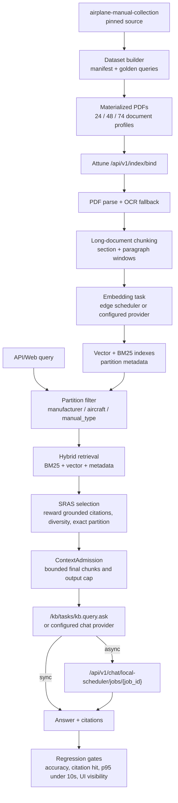

# Airplane Manual Long-Text KB Dataset

Date: 2026-07-08

Source: <https://github.com/shiroinekotfs/airplane-manual-collection>

Pinned commit: `afe8288495338880e165f77bb9afe9946f366a52`

## Purpose

This dataset turns `airplane-manual-collection` into a deterministic long-text
KB benchmark for edge scheduler RAG. It is designed to expose failures that still
exist with very large context windows:

- relevant manual retrieved but buried after too many neighboring chunks;
- large FCOM/AMM PDFs dominating the candidate set by volume;
- model answers from parametric memory instead of local KB citations;
- cross-document queries that need two sources but should not stuff all manuals;
- partition mistakes across manufacturer, aircraft, and manual type.

The upstream repository README warns that the manuals may not be verified for
real-life use. This dataset is only for retrieval and context-admission testing.
It must not be used for operational flight, maintenance signoff, or emergency
procedure advice.

## Generated Artifacts

- `tests/e2e/airplane_manual_longtext_cases.json`
  - e2e manifest with selected documents, query expectations, source root,
    index partitions, and edge scheduler profile metadata.
- `rust/tests/golden/airplane_manual_queries.json`
  - J6/RAG-quality compatible golden query file using stable document ids.
- `scripts/build-airplane-manual-longtext-dataset.py`
  - reproducible generator. It uses GitHub tree API when available and falls
    back to a local partial clone plus pinned size hints.
- `tests/e2e/airplane_manual_longtext_e2e.py`
  - opt-in end-to-end gate. It materializes the selected PDFs under HOME, asks
    Attune to bind the directory and build the vector DB, waits for embedding
    drain, then runs search, API chat, and Web UI gates.
- `tests/e2e/playwright/airplane_manual_longtext_ui_e2e.py`
  - browser gate against the already-built vector DB. It verifies indexed item
    visibility, chat input, visible answer/citations, scheduler status rendering, and
    10s visible-response latency.

Default generated set:

- documents: 74
- queries: 60
- selected known bytes: about 1.28 GB, with additional selected files whose
  sizes are filled when the GitHub tree API is available
- source root in checked-in manifest: `/data/corpora/airplane-manual-collection`

The source root is a metadata-only partial clone by default. PDF blobs are not
downloaded until `--materialize` is used.

The full E2E runner regenerates a temporary manifest with `source_root` under
the server user's HOME because `/api/v1/index/bind` only accepts directories
inside HOME.

## E2E Architecture



This test intentionally validates the retrieval stack rather than the maximum
context length of a single model. The expected success path is a small cited
evidence packet selected from a thousands-page corpus, followed by an answer that
meets the 10s response target on the configured edge scheduler profile.

Attune also enforces a product-level final prompt admission cap before any
LLM call. The default is `ATTUNE_CONTEXT_ADMISSION_MAX_INPUT_TOKENS=65536`,
even when the provider advertises a 1M-token window. Raise that variable only
for explicit evaluation runs; the long-text KB path should normally improve
partitioning, SRAS selection, citation coverage, and compression rather than
filling the provider window.

## Profiles

`smoke`

- 8 documents.
- Purpose: fast ingest sanity check and index partition routing.
- Use before running expensive PDF extraction or OCR paths.

`edge_scheduler_30b`

- 24 documents.
- Purpose: edge scheduler RAG with SRAS and context-admission budget.
- Expected cap: no more than 4 retrieved context documents and 12 final chunks
  for the answer stage.

`edge_scheduler_comprehensive`

- 48 documents.
- Purpose: thousands-page vector DB test across major aircraft/manual types.
- Expected cap: no more than 6 retrieved context documents and 18 final chunks
  for the answer stage.

`stress`

- 74 documents.
- Purpose: long-context decay, large-manual dominance, and mixed Airbus/Boeing
  retrieval pressure.

## Regeneration

Regenerate manifests without downloading PDFs:

```bash
python3 scripts/build-airplane-manual-longtext-dataset.py --no-github-api
```

Regenerate with golden query output:

```bash
python3 scripts/build-airplane-manual-longtext-dataset.py \
  --golden-out rust/tests/golden/airplane_manual_queries.json \
  --no-github-api
```

Materialize selected PDFs for an actual ingest run:

```bash
python3 scripts/build-airplane-manual-longtext-dataset.py \
  --repo-dir /data/corpora/airplane-manual-collection \
  --materialize \
  --limit-docs 24 \
  --no-github-api
```

Use `--limit-docs 24` for the first edge scheduler pilot, `48` for the comprehensive
thousands-page gate, and `74` for stress.

For the comprehensive thousands-page gate, use:

```bash
python3 scripts/build-airplane-manual-longtext-dataset.py \
  --repo-dir /data/corpora/airplane-manual-collection \
  --materialize \
  --limit-docs 48 \
  --no-github-api
```

For the first edge scheduler ingest pilot, prefer `--limit-docs 24` and the `edge_scheduler_30b`
profile. Use `--limit-docs 74` only for stress.

## Evaluation Contract

For each query:

- `acceptable_hits` is the document-id ground truth.
- `partition_expectation` describes the intended easy-to-build index partition:
  manufacturer, aircraft, and manual type.
- `expect_any` is a lightweight textual sanity check for answer/citation output.
- `min_hit_in_top_k` is the retrieval threshold for Hit@K/MRR style scoring.

Coverage now includes:

- exact manual lookup and manual-type disambiguation;
- aircraft and variant partition precision;
- ATA topic lookup across Airbus/Boeing;
- cross-document and multi-part manual retrieval;
- large-PDF dominance resistance;
- negative neighboring-document disambiguation;
- long-context decay probes;
- Web chat surface checks.

edge scheduler runner should report:

- Hit@K, Recall@K, and MRR against `acceptable_hits`;
- partition hit rate before vector/rerank;
- selected context document count and final chunk count;
- citation hit rate in the answer;
- scheduler queue/runtime metrics for `kb.query.ask`.

Initial vector-search acceptance targets:

- Hit@5 >= 0.90
- Recall@10 >= 0.85
- MRR@10 >= 0.75
- partition hit rate >= 0.95
- warm p50 search latency <= 800 ms
- warm p95 search latency <= 2500 ms

Initial edge scheduler answer targets:

- answer accuracy rate >= 0.90
- citation hit rate >= 0.90
- unsafe operational advice rate = 0
- edge scheduler 30B-class p95 answer latency <= 10000 ms

## 2026-07-09 X100 Pilot Result

Environment:

- Host: `192.168.100.140`, Bianbu 4.0.1, `riscv64`, SpacemiT X100/A100.
- Observed memory: 15 GiB total. Treat this as an X100 low-memory pilot, not a
  confirmed 32 GiB result.
- Scheduler: `:8090`, hot `embedding-int8`, `reranker-int8`, `llm-summary`.
- Attune: `scheduler-runtime` RVA23 artifact, no direct llama.cpp/ORT worker
  invocation in the server process.
- Corpus profile: `edge_scheduler_comprehensive`, 48 selected manuals, 42
  applicable evaluation queries.

Root-cause fix before the final run:

- 16 selected scanned/image PDFs were previously absent from the vector DB
  because scheduler OCR returned `model_unavailable`.
- Ingest now has a generic metadata-only fallback for PDF/Office/image/audio
  documents when parser/OCR/ASR fails or returns empty content. The fallback
  stores title/path/source terms and enqueues at least one embedding chunk.
- Blank `.md`/`.txt` behavior remains unchanged: empty text files still skip.

Final search gate after metadata fallback, chunk-hit de-duplication, and
source-aware SRAS:

| Metric | Result | Target | Status |
| --- | ---: | ---: | --- |
| queries | 42 | - | - |
| errors | 0 | 0 | pass |
| Hit@5 | 1.000 | >= 0.900 | pass |
| Hit@10 | 1.000 | >= 0.900 | pass |
| Recall@10 | 0.952 | >= 0.850 | pass |
| MRR@10 | 0.897 | >= 0.750 | pass |
| p50 latency | 906 ms | <= 800 ms | fail |
| p95 latency | 1278 ms | <= 2500 ms | pass |

Final API chat gate:

| Metric | Result | Target | Status |
| --- | ---: | ---: | --- |
| queries | 42 | - | - |
| errors | 0 | 0 | pass |
| citation hit rate | 1.000 | >= 0.900 | pass |
| answer accuracy rate | 0.810 | >= 0.900 | fail |
| answer term hit rate | 0.829 | - | observe |
| unsafe operational advice rate | 0.000 | 0.000 | pass |
| p50 latency | 14.9s | - | observe |
| p95 latency | 20.9s | <= 10.0s | fail |
| max knowledge count | 5 | <= 6 context documents | pass |
| max compression chunks | 0 | <= 18 final chunks | pass |

The remaining 8 answer misses all had correct citations. Seven were term misses
from short `llm-summary` output on subsystem/manual-type queries; one was the
safety-boundary prompt where retrieval was correct and unsafe advice was not
emitted, but the answer did not contain an explicit enough refusal phrase. This
is now an answer-worker/template/policy problem, not a retrieval recall problem.

Final Web UI gate:

| Check | Result |
| --- | --- |
| Indexed item visible in Items view | pass (`QRH320`) |
| Chat input submits manifest query | pass |
| Answer term hit | pass |
| Citation hit and visible citation UI | pass |
| Scheduler status visible | pass |
| Visible latency | 4.22s, pass under 10s |

On the RISC-V host, Python Playwright packages were version-mismatched with the
system Node driver, so the browser gate also has a Node/Playwright fallback:
`tests/e2e/playwright/airplane_manual_longtext_ui_e2e.js`. It uses the same
manifest semantics and can be pointed at a system browser with
`ATTUNE_PLAYWRIGHT_EXECUTABLE=/usr/bin/chromium`.

## Full E2E Gate

The expected regression flow is:

1. Materialize the selected airplane manuals under
   `~/attune-e2e-corpora/airplane-manual-collection`.
2. Generate a temporary manifest that points at that HOME-local corpus.
3. Call `POST /api/v1/index/bind` with `file_types=["pdf","md","txt"]` and
   `corpus_domain="aviation"`.
4. Poll `/api/v1/index/status` until `pending_embeddings=0`.
5. Run the vector-search gate.
6. Ask chat questions against the built vector DB and fail if answer accuracy,
   citations, safety refusal, context size, or 10s p95 latency regress.
7. Open the Web UI with Playwright, verify the indexed manual is visible in the
   Items view, ask a manifest query through the chat box, and fail if the
   visible answer/citation/scheduler status/10s latency surface regresses.

Run the comprehensive gate through the E2E runner:

```bash
ATTUNE_E2E_LONGTEXT=1 ATTUNE_LONGTEXT_PROFILE=edge_scheduler_comprehensive \
  bash tests/e2e/run_all.sh
```

For an edge scheduler pilot. RISC-V/X100 is the first profile host; Windows/Linux x86
high-performance schedulers should reuse the same Attune entrypoint:

```bash
ATTUNE_E2E_LONGTEXT=1 \
ATTUNE_LONGTEXT_PROFILE=edge_scheduler_comprehensive \
ATTUNE_E2E_LOCAL_SCHEDULER=http://127.0.0.1:8090 \
  bash tests/e2e/run_all.sh
```

Current scheduler builds expose embedding through KB tasks such as
`/kb/tasks/kb.query.embed`; the proposed `/v1/embeddings` thin route is not
required for this gate. The runner defaults edge scheduler to `llm-summary`,
`embedding-int8`, 512 dimensions, and `kb.query.embed`; override with
`ATTUNE_E2E_LLM_MODEL`, `ATTUNE_E2E_EMBEDDING_MODEL`,
`ATTUNE_E2E_EMBEDDING_DIMS`, or `ATTUNE_E2E_EMBEDDING_TASK` when testing a new
contract. New tests should use `ATTUNE_E2E_LOCAL_SCHEDULER`. For very large OCR
runs, raise `ATTUNE_LONGTEXT_BIND_TIMEOUT_SEC`.

For the test pyramid entrypoint:

```bash
bash scripts/test-pyramid.sh --with-longtext-e2e
```

The long-text gate is not part of the default test pyramid because it performs
large PDF downloads and expensive indexing.

To run only the browser surface after the corpus is already indexed:

```bash
python3 tests/e2e/playwright/airplane_manual_longtext_ui_e2e.py \
  --manifest /tmp/attune-airplane-longtext-edge_scheduler_comprehensive.json \
  --base-url http://localhost:18905 \
  --profile edge_scheduler_comprehensive
```

Set `ATTUNE_LONGTEXT_UI=0` only when isolating API/search regressions; the
blocking long-text E2E path keeps Web UI validation enabled.

Run the search-layer gate after the vector DB is built:

```bash
python3 scripts/eval-airplane-manual-longtext-search.py \
  --base-url http://127.0.0.1:8787 \
  --token "$ATTUNE_TOKEN" \
  --profile edge_scheduler_30b \
  --limit 10 \
  --out /tmp/airplane-local-scheduler-search.json
```

Use `--profile edge_scheduler_comprehensive` after the 48-document set is indexed, and
`--fail-on-targets` when turning this into a blocking regression gate.

Run the answer/citation gate after chat or edge scheduler is configured:

```bash
python3 scripts/eval-airplane-manual-longtext-chat.py \
  --base-url http://127.0.0.1:8787 \
  --token "$ATTUNE_TOKEN" \
  --profile edge_scheduler_30b \
  --out /tmp/airplane-local-scheduler-chat.json \
  --fail-on-targets
```

This gate follows scheduler async jobs through `/api/v1/chat/local-scheduler/jobs/{job_id}` and
checks answer accuracy, citation hit rate, answer latency, context chunk count,
and safety refusal for operational-flight prompts.

## Edge Scheduler Retrieval Shape

The dataset is intentionally partition-friendly. The expected edge scheduler pipeline is:

1. Parse aircraft/manual tokens from the query.
2. Apply index partition filters first:
   `manufacturer`, `aircraft`, `manual_type`.
3. Run hybrid retrieval inside those partitions.
4. Apply SRAS selection:
   - reward exact partition match;
   - reward source diversity for cross-document queries;
   - penalize long neighboring chunks that do not add new facts;
   - penalize unsafe operational-answer intents.
5. Compress per selected document before the final answer.
6. Answer with citations; do not fill a 1M-token context just because it exists.

For edge scheduler, success is not "the model saw all manuals". Success is that the local
retrieval stack selects a small, citeable context set that keeps the answer
grounded even when the corpus contains hundreds of MB of adjacent manuals.
