# Local Scheduler Runtime Boundary

> Updated: 2026-07-08  
> Pilot source inspected: `/data/RV/k3-scheduler`. Public Attune naming uses
> `local scheduler` / `scheduler` so the same boundary can support RISC-V,
> Windows high-performance, and Linux x86 platforms.

## Rule

Attune owns product policy, privacy, retrieval planning, context admission,
index partitioning, citations, and cloud fallback. The scheduler owns local
model lifecycle, worker selection, hardware arbitration, and platform-specific
acceleration.

Attune server runtime must not directly call concrete local inference workers
or probe their private endpoints. Local inference goes through:

- `POST /kb/tasks/kb.query.embed`
- `POST /kb/tasks/kb.query.rerank`
- `POST /kb/tasks/kb.query.ask`
- `POST /kb/tasks/kb.document.ocr_recognize`
- `POST /kb/tasks/kb.meeting.asr_frontend`
- `GET /jobs/{job_id}` and cancel routes for async completion

Cloud model calls remain behind Attune privacy and outbound policy. They are a
fallback or user-selected provider, not a bypass around the scheduler boundary.

## Architecture

```mermaid
flowchart LR
  subgraph Surfaces["Attune surfaces"]
    Web["Web UI"]
    Api["REST API"]
    Jobs["Durable jobs"]
    Sync["Connector sync<br/>upload / folder / Git / Email / WebDAV / RSS"]
  end

  subgraph Attune["Attune policy and retrieval plane"]
    Settings["Settings<br/>scheduler base"]
    Privacy["Privacy + OutboundGate"]
    Parse["Parser / ingest options<br/>scheduler-aware OCR/ASR"]
    Index["FTS + vector index<br/>partition filters"]
    SRAS["SRAS retrieval planner<br/>reward-aware selection"]
    Admission["ContextAdmission<br/>sync/async/reject/cloud"]
    Evidence["Cited evidence windows<br/>not raw long context"]
  end

  subgraph Boundary["Scheduler API boundary"]
    Client["LocalSchedulerClient"]
    Contract["/benchmark/contract"]
    Capacity["/models + /capacity"]
    Tasks["/kb/tasks/{task}"]
    Async["/jobs/{job_id}"]
  end

  subgraph Platforms["Scheduler implementations"]
    Pilot["RISC-V pilot"]
    Win["Windows high-performance<br/>DirectML / OpenVINO / CUDA / ROCm / CPU"]
    Linux["Linux x86<br/>CUDA / ROCm / OpenVINO / CPU"]
  end

  subgraph Workers["Concrete workers hidden from Attune"]
    Embed["Embedding"]
    Rerank["Rerank"]
    LLM["Bounded local LLM"]
    OCR["OCR"]
    ASR["ASR"]
  end

  Cloud["Cloud LLM<br/>privacy-gated fallback"]

  Web --> Api
  Api --> Settings
  Jobs --> Settings
  Sync --> Parse
  Settings --> Privacy
  Privacy --> Parse
  Parse --> Index
  Index --> SRAS
  SRAS --> Evidence
  Evidence --> Admission
  Admission -->|local| Client
  Admission -->|allowed fallback| Cloud
  Client --> Contract
  Client --> Capacity
  Client --> Tasks
  Client --> Async
  Tasks --> Platforms
  Platforms --> Workers
  Workers --> Async
```

## Implemented Attune Boundary

- Chat local KB answer generation submits `kb.query.ask` and polls scheduler
  async jobs through Attune proxy routes.
- High-confidence local KB source lookup and safety-refusal responses may be
  answered synchronously by Attune from already-retrieved evidence. This is a
  prompt/generation latency optimization, not a local model-worker bypass; the
  slower synthesis path still uses scheduler-native `kb.query.ask`.
- Embedding and rerank providers use scheduler KB tasks instead of direct local
  runtime providers.
- Office OCR, document OCR recognition, and ASR job workers submit scheduler KB
  tasks instead of invoking local OCR/ASR backends directly.
- Upload, staged drain, bound-folder scan, Git, Email, WebDAV, RSS, and JSON
  ingest pass `IngestOptions` into `attune-core` so image/scanned-PDF/audio
  parsing uses scheduler OCR/ASR on server paths.
- `/api/v1/ai-stack`, `/api/v1/status`, and readiness routes report scheduler
  capability only; they do not inspect concrete local runtimes.
- Scheduler contract fixtures, runtime profile cache/TTL, and classified
  scheduler error mapping live on the Attune side so non-X100 scheduler
  implementations can reuse the same product path.

Run `scripts/scheduler-boundary-audit.sh` before merging scheduler changes. The
audit fails if server/UI code reintroduces direct local runtime symbols,
private local runtime endpoints, or legacy parser/ingest entrypoints.
CI runs this audit as an independent scheduler-boundary gate.
