# Edge Scheduler Runtime Boundary

> Updated: 2026-07-11
> Pilot scheduler implementation inspected. Public Attune naming uses
> `edge scheduler` / `scheduler`; `local scheduler` remains a compatibility
> alias for existing configs and routes.

## Rule

Attune owns product policy, privacy, retrieval planning, context admission,
index partitioning, citations, and cloud fallback. The scheduler owns local
model lifecycle, worker selection, hardware arbitration, and platform-specific
acceleration.

Attune server runtime must not directly call concrete local inference workers
or probe their private endpoints. Local/edge inference goes through:

- `POST /kb/tasks/kb.query.embed`
- `POST /kb/tasks/kb.query.rerank`
- `POST /kb/tasks/kb.query.ask`
- `POST /kb/tasks/kb.document.ocr_recognize`
- `POST /kb/tasks/kb.meeting.asr_frontend`
- `GET /jobs/{job_id}` and cancel routes for async completion

Cloud model calls remain behind Attune privacy and outbound policy. They are a
fallback or user-selected provider, not a bypass around the scheduler boundary.

## Architecture

```mermaid
flowchart LR
  subgraph Surfaces["Attune surfaces"]
    Web["Web UI"]
    Api["REST API"]
    Jobs["Durable jobs"]
    Sync["Connector sync<br/>upload / folder / Git / Email / WebDAV / RSS"]
  end

  subgraph Attune["Attune policy and retrieval plane"]
    Settings["Settings<br/>scheduler base"]
    Privacy["Privacy + OutboundGate"]
    Parse["Parser / ingest options<br/>scheduler-aware OCR/ASR"]
    Index["FTS + vector index<br/>partition filters"]
    SRAS["SRAS retrieval planner<br/>reward-aware selection"]
    Evidence["Source-diverse cited evidence<br/>bounded windows"]
    AnswerBudget["Answer budget policy<br/>lookup / balanced / synthesis"]
    Admission["ContextAdmission<br/>sync/async/reject/cloud"]
  end

  subgraph Boundary["Scheduler API boundary"]
    Client["LocalSchedulerClient"]
    Contract["/benchmark/contract"]
    Capacity["/models + /capacity"]
    Tasks["/kb/tasks/{task}"]
    Async["/jobs/{job_id}"]
  end

  subgraph Platforms["Scheduler implementations"]
    Pilot["RISC-V pilot"]
    Win["Windows high-performance<br/>DirectML / OpenVINO / CUDA / ROCm / CPU"]
    Linux["Linux x86<br/>CUDA / ROCm / OpenVINO / CPU"]
  end

  subgraph Workers["Concrete workers hidden from Attune"]
    Embed["Embedding"]
    Rerank["Rerank"]
    LLM["Bounded local LLM"]
    OCR["OCR"]
    ASR["ASR"]
  end

  Cloud["Cloud LLM<br/>privacy-gated fallback"]

  Web --> Api
  Api --> Settings
  Jobs --> Settings
  Sync --> Parse
  Settings --> Privacy
  Privacy --> Parse
  Parse --> Index
  Index --> SRAS
  SRAS --> Evidence
  Evidence --> AnswerBudget
  AnswerBudget --> Admission
  Admission -->|local| Client
  Admission -->|allowed fallback| Cloud
  Client --> Contract
  Client --> Capacity
  Client --> Tasks
  Client --> Async
  Tasks --> Platforms
  Platforms --> Workers
  Workers --> Async
```

## Implemented Attune Boundary

- Chat local KB answer generation submits `kb.query.ask` and polls scheduler
  async jobs through Attune proxy routes.
- High-confidence local KB source lookup and safety-refusal responses may be
  answered synchronously by Attune from already-retrieved evidence. This is a
  prompt/generation latency optimization, not a local model-worker bypass; the
  slower synthesis path still uses scheduler-native `kb.query.ask`.
- Embedding and rerank providers use scheduler KB tasks instead of direct local
  runtime providers.
- Office OCR, document OCR recognition, and ASR job workers submit scheduler KB
  tasks instead of invoking local OCR/ASR backends directly.
- Upload, staged drain, bound-folder scan, Git, Email, WebDAV, RSS, and JSON
  ingest pass `IngestOptions` into `attune-core` so image/scanned-PDF/audio
  parsing uses scheduler OCR/ASR on server paths.
- Oversize/scanned PDF OCR is page-scheduled by Attune: extract the text layer
  first, then render one PDF page at a time with Poppler and submit bounded
  `image_base64` page payloads to `kb.document.ocr_recognize`. Attune does not
  inline whole large PDFs, does not render all pages into memory at once, and
  polls the scheduler async job to terminal state before deciding whether OCR
  truly failed. Background ingest uses the long-budget async OCR profile,
  including full detected-page coverage by default, no default document-level
  hard cutoff, 180s per-page job polling, a 30s render budget, an unknown-page
  fallback cap, lower-DPI retries for image-size failures, and vertical strip
  retries for scheduler layout/line-limit terminal errors; interactive PDF OCR
  keeps the shorter bounded defaults.
- `/api/v1/ai-stack`, `/api/v1/status`, and edge-scheduler readiness routes report scheduler
  capability only; they do not inspect concrete local runtimes.
- Scheduler contract fixtures, runtime profile cache/TTL, and classified
  scheduler error mapping live on the Attune side so non-X100 scheduler
  implementations can reuse the same product path.
- Chat uses Attune-owned answer-budget policy before calling `kb.query.ask`.
  Realtime test gates may force an explicit short output budget, while product
  traffic defaults to query-aware `lookup` / `balanced` / `synthesis` budgets
  and reports the selected budget in the API response.
- Chat evidence assembly keeps bounded context windows and applies source
  diversity for cross-document or cross-vendor questions before scheduler
  answer generation. The scheduler receives compact cited evidence packets, not
  raw long documents.
- OCR and job-proxy failures include task, operation, component, retryability,
  and degradation-policy fields. Scanner/OCR worker failures are not converted
  into empty OCR success payloads unless the successful scheduler response
  explicitly marks a degraded scaffold result.

## Degradation Policy

Attune defaults to honest scheduler failure. A scheduler delay, cancellation,
TTL expiry, admission rejection, queue overload, transport failure, invalid
response, or worker failure must reach the API/Web caller as a structured
`local-scheduler-*` error unless the call site has an independent reduced
result and marks it explicitly.

Allowed explicit degradation:

- High-confidence source lookup from already-retrieved KB evidence may answer
  extractively without local generation, with citations attached.
- Search/rerank can fall back to deterministic retrieval order, BM25/vector/RRF,
  or source filters when the optional ranking worker is unavailable; the answer
  still uses cited evidence windows.
- OCR recognition may return a successful scaffold/no-layout result only when
  the payload carries `degraded: true`, `degradation_reason`, honest
  `engine_status`, and validation warnings.
- UI/cost telemetry may omit unavailable metrics, but must not fabricate zeroes
  for paths that did not run.

Not allowed to silently degrade:

- Chat `kb.query.ask`, Office OCR, document OCR task submission, and ASR durable
  jobs. Queue delay or scheduler failure returns `local-scheduler-delayed`,
  `local-scheduler-cancelled`, `local-scheduler-expired`,
  `local-scheduler-job-failed`, or another classified scheduler code.
- Oversize/admission failures. The caller must shrink evidence, route async, or
  return the structured error; it must not stretch context or drop citations
  invisibly.
- Safety-critical aviation/maintenance procedure answers. If the evidence is
  missing or generation is not available in the admitted latency budget, Attune
  refuses or reports delay/failure instead of substituting a weaker procedural
  answer.

## Attune Long-Text Gates

The airplane-manual long-text E2E covers Attune-owned behavior independent of
the scheduler implementation:

- selected-document materialization and `/api/v1/index/bind`;
- embedding drain metrics (`duration_ms`, `max_pending`, `samples`);
- search hit/recall/MRR and latency;
- chat citation/answer/safety metrics;
- scheduler generation coverage, prompt-cache metadata, finish reasons, and
  generation latency;
- Attune answer-budget metadata coverage;
- failure classification that separates retryable scheduler backend errors
  from Attune answer-quality failures while preserving honest-failure metadata;
  and
- Web UI answer, citation, latency, and scheduler-status visibility.

Scheduler hardware and model workers remain replaceable behind the contract.
Attune gates should fail when product policy metadata is missing, even if the
worker happens to return text.

Run `scripts/scheduler-boundary-audit.sh` before merging Attune scheduler-boundary changes. The
audit fails if server/UI code reintroduces direct local runtime symbols,
private local runtime endpoints, or legacy parser/ingest entrypoints.
CI runs this audit as an independent scheduler-boundary gate.
