# Local Scheduler Attune Integration Development Plan

> Date: 2026-07-07  
> Scope: Attune-side architecture and implementation plan. local scheduler is the pilot; Windows scheduler is a follow-up target.  
> Source of truth inspected: `/data/RV/k3-scheduler` (`docs/api.md`, `src/routes.cpp`, `runtime_model`, `capability.json`, scheduler admission tests). Attune docs and code use `local scheduler` / `scheduler` naming for the cross-platform boundary.

## 0. Implementation Status

S1-S5 core have been started in Attune:

- Added `edge_cloud::scheduler::LocalSchedulerClient` and tolerant DTOs for `/benchmark/contract`, `/models`, `/capacity`, `/jobs`, and `/kb/tasks`.
- Corrected `HttpCapacityClient` to derive `CapacitySignal` from real local scheduler `/models` + `/capacity` instead of the old non-existent `/capacity?model=` schema.
- Added mock/fixture tests for real scheduler schema and the capacity derivation path.
- Added `edge_cloud::runtime_profile::RuntimeProfileResolver`, which merges `/benchmark/contract`, `/models`, and `/capacity` into model/task runtime profiles.
- Added static conservative local scheduler 32G fallback profiles for `embedding-int8`, `reranker-int8`, `llm-summary`, `llm-chat`, and `vlm`.
- Added `context_admission`, a pure final-prompt admission module that returns sync, async, cloud-fallback, or reject decisions before any LLM call.
- Product cap calibration is now separate from scheduler hard caps: `llm-chat` keeps scheduler sync hard cap 4096 but uses a 1024-token tested sync cap for interactive admission.
- Added `edge_cloud::kb_task::SchedulerKbTaskAdapter`, which applies ContextAdmission before `/kb/tasks/{task}`, injects `context_tokens` / `max_output_tokens` hints, submits explicit async when required, and leaves cloud fallback to Attune policy.
- Added `retrieval_plan`, a pure SRAS + index-partition planning layer for edge-native retrieval before BM25/vector/RRF. It caps local scheduler foreground rerank to 20 candidates, builds privacy/domain/language/embedding partition filters, and converts plans to existing `SearchParams`.
- Added S6 pilot wiring: local scheduler form-factor chat search now uses `retrieval_plan` to build bounded `SearchParams`, then submits answer generation through scheduler-native `kb.query.ask`. Laptop/server chat keeps legacy defaults.
- Added Attune server proxy routes for local scheduler async jobs: `GET /api/v1/chat/local-scheduler/jobs/{job_id}` and `DELETE /api/v1/chat/local-scheduler/jobs/{job_id}`.
- Added front-end live local scheduler job handling for chat: async `local_scheduler.job_id` responses are polled through the Attune server proxy, the assistant message is updated in place when the job completes, and a compact local scheduler status strip shows job/model/context metadata.
- Added `attune-server::retrieval_policy`, a shared route-level retrieval planner wrapper used by both chat and public search. `/api/v1/search` and `/api/v1/search/relevant` now use the local scheduler SRAS/index-partition plan on local scheduler form factor while preserving legacy explicit `initial_k` / `intermediate_k` overrides on non-local scheduler machines.
- Added the server runtime boundary: local LLM readiness, embedding, rerank, OCR, ASR, upload ingest, staged drain, folder scan, Git, Email, WebDAV, and RSS now route local intelligent work through scheduler-aware adapters instead of concrete local runtime calls.
- Added `docs/local-scheduler-runtime-boundary.md` and `scripts/scheduler-boundary-audit.sh` to document and enforce the no-direct-local-runtime boundary.

Verified on 2026-07-07:

- `cargo test -p attune-server routes::chat:: --manifest-path rust/Cargo.toml`
- `cargo test -p attune-core --test retrieval_plan --manifest-path rust/Cargo.toml`
- `cargo test -p attune-core --test local_scheduler_kb_task_adapter --manifest-path rust/Cargo.toml`
- `cargo test -p attune-core --test context_admission --test local_scheduler_runtime_profile --test local_scheduler_contract --test edge_cloud_capacity`
- `cargo test -p attune-core --test retrieval_plan --test local_scheduler_kb_task_adapter --test context_admission --test local_scheduler_runtime_profile --test local_scheduler_contract --test edge_cloud_capacity --manifest-path rust/Cargo.toml`
- `cargo test -p attune-core edge_cloud::`
- `cargo test -p attune-core context_admission`
- `npm run typecheck` in `rust/crates/attune-server/ui`
- `npm run build` in `rust/crates/attune-server/ui`
- `cargo test -p attune-server retrieval_policy:: --manifest-path rust/Cargo.toml`
- `cargo test -p attune-server routes::search:: --manifest-path rust/Cargo.toml`

## 1. Ground Truth From `local-scheduler`

The current `local-scheduler` business surface is not primarily OpenAI-compatible. It exposes a scheduler-native API:

| Method | Path | Status | Use |
|:---|:---|:---|:---|
| `GET` | `/ready` | implemented | process liveness |
| `GET` | `/ready?hot=1` | implemented | hot-set traffic admission |
| `GET` | `/healthz` | implemented | deep health and memory status |
| `GET` | `/models` / `/models/{name}` | implemented | per-model lifecycle, derived state, queue depth |
| `GET` | `/capacity` | implemented | cluster/resource/memory snapshot |
| `GET` | `/benchmark/contract` | implemented | machine-readable model/runtime contract |
| `POST` | `/infer/{name}` | implemented | low-level sync inference |
| `POST` | `/infer/{name}:async` | implemented | low-level async inference |
| `POST` | `/kb/tasks/{task}` | implemented | application-facing KB task API |
| `POST` | `/kb/tasks/{task}:async` | implemented | explicit async KB task |
| `GET` | `/jobs/{job_id}` | implemented | async status/result |
| `POST` | `/jobs/{job_id}:cancel` | implemented | best-effort cancel |
| `DELETE` | `/jobs/{job_id}` | implemented | cancel alias |
| `GET` | `/events` | implemented | SSE model/capacity updates |
| `GET` | `/metrics` | implemented | Prometheus metrics |

Important correction for Attune:

- `GET /capacity` does not currently return `{state, eta_ms, mem_headroom_mb}` for `?model=...`.
- Per-model `READY_FAST` / `QUEUED` / `READY_SLOW` / `UNAVAILABLE`, queue depth, and lifecycle come from `/models`.
- Sync/async limits, `max_context_tokens_*`, `max_output_tokens_*`, service classes, and runtime tasks come from `/benchmark/contract`.
- `/v1/embeddings`, `/v1/chat/completions`, `/v1/models`, and `/api/*` should not be treated as the first integration surface. In this repo they are still proposal/backend-profile references, not registered public scheduler routes.
- There is no `/tokenize` or `/admit` endpoint today. Attune must do tokenizer-aware admission itself, then send `context_tokens` and `max_output_tokens` hints to scheduler.

## 2. Target Architecture

Attune should integrate the scheduler as a typed local runtime, not as a generic OpenAI-compatible endpoint.

```mermaid
flowchart LR
  subgraph Surfaces["Attune surfaces"]
    Web["Web UI / Playwright"]
    Api["API chat and search"]
    Ingest["Ingest / doc tasks"]
  end

  subgraph Attune["Attune policy and retrieval plane"]
    Settings["Settings + FormFactor<br/>LocalSchedulerAppliance"]
    Privacy["Privacy policy + OutboundGate"]
    Partitions["Index partitions<br/>manufacturer / domain / language / manual_type"]
    SRAS["SRAS selector<br/>reward grounded, diverse, local evidence"]
    Admission["ContextAdmission<br/>token budget + memory/runtime profile"]
    Citations["Evidence packet<br/>small cited windows, not raw long context"]
  end

  subgraph Runtime["Typed local scheduler runtime"]
    Client["LocalSchedulerClient"]
    Contract["/benchmark/contract"]
    Capacity["/models + /capacity"]
    KbTasks["/kb/tasks/{task}"]
    Jobs["/jobs/{id}"]
  end

  subgraph LocalPlatform["Platform scheduler implementations"]
    Pilot["RISC-V local scheduler pilot"]
    Win["Windows high-performance scheduler<br/>DirectML / OpenVINO / CUDA / ROCm / CPU"]
    Linux["Linux x86 scheduler<br/>CUDA / ROCm / OpenVINO / CPU"]
  end

  subgraph Workers["Local worker pool"]
    Embed["Embedding"]
    Rerank["Rerank"]
    Llm["Bounded LLM answer"]
    Ocr["OCR"]
    Asr["ASR"]
  end

  Cloud["Cloud LLM / remote API<br/>Attune-owned fallback only"]

  Web --> Api
  Api --> Settings
  Ingest --> Partitions
  Settings --> Privacy
  Privacy --> Partitions
  Partitions --> SRAS
  SRAS --> Citations
  Citations --> Admission
  Admission -->|local allowed| Client
  Admission -->|privacy allows and local unavailable| Cloud
  Client --> Contract
  Client --> Capacity
  Client --> KbTasks
  Client --> Jobs
  Client --> LocalPlatform
  LocalPlatform --> Workers
  Workers --> Jobs
  Jobs --> Api

  Privacy -. no cloud credentials .-> Runtime
  Api -. no direct worker bypass .-> Workers
```



Architecture invariants:

- Attune owns user-facing policy: privacy level, cloud eligibility, evidence selection, citation requirements, token budgeting, and refusal behavior.
- The scheduler owns local mechanism: worker lifecycle, device arbitration, queues, async jobs, memory gates, and service-class admission.
- Local answers must flow through bounded evidence packets. Even a 1M-token model window is not a reason to inject full manuals or unranked adjacent chunks.
- Windows and Linux high-performance boxes should implement the same scheduler contract; Attune should not fork product logic by hardware vendor.
- Target-specific AVX/RVV/GPU optimization is a build/deployment concern. See `docs/build-optimization.md`; product code consumes scheduler capability metadata rather than hardcoding vendor paths.

```text
Attune query / doc task / chat
        |
        v
SRAS retrieval selector + evidence-window builder
        |
        v
ContextAdmission
  - exact/local tokenizer if available
  - conservative estimator otherwise
  - ModelRuntimeProfile from scheduler contract + benchmark calibration
        |
        v
LocalSchedulerClient
  - GET /benchmark/contract
  - GET /models
  - GET /capacity
  - POST /kb/tasks/{task}
  - GET /jobs/{id}
        |
        +-- local sync task result
        +-- local async job handle
        +-- local unavailable / too slow -> Attune policy decides queue, refuse, or cloud
```

Responsibilities:

- Attune owns privacy, SRAS, evidence selection, token counting, citation requirements, local/cloud policy, and cloud redaction.
- local scheduler owns local worker lifecycle, A100/X100 arbitration, queueing, async jobs, runtime task mapping, memory gates, and service-class admission.
- Scheduler must not receive cloud credentials and must not make privacy/cloud decisions in the local scheduler pilot.

## 3. Interface Mapping

### Discovery

Attune startup or health refresh:

1. `GET /ready`
2. `GET /ready?hot=1`
3. `GET /benchmark/contract`
4. `GET /models`
5. `GET /capacity`

Cache `/benchmark/contract` with a short TTL and a revision key. It is the runtime profile seed for local scheduler.

### Model Capacity Derivation

Replace the current simplified `HttpCapacityClient` assumption with:

```text
ModelCapacitySignal {
  model,
  state,              // from /models[].state
  lifecycle,          // from /models[].lifecycle
  dispatchable,       // from /models[].dispatchable
  queue_depth,
  queue_capacity,
  eta_ms,             // derived from queue_depth * estimated_runtime_ms, or scheduler hint where available
  memory_status,      // from /capacity.memory.status
  dram_available_gb,  // from /capacity.memory.available_gb when present
  revision
}
```

Use `/capacity` as cluster context, not as a direct model-state API.

### KB Task Calls

Preferred Attune calls:

| Attune need | Scheduler task |
|:---|:---|
| foreground query embedding | `POST /kb/tasks/kb.query.embed` |
| foreground candidate rerank | `POST /kb/tasks/kb.query.rerank` |
| bounded local KB answer | `POST /kb/tasks/kb.query.ask` |
| answer stage for eval/debug | `POST /kb/tasks/kb.query.answer` |
| compact VLM extraction | `POST /kb/tasks/kb.query.vlm_extract` |
| document OCR detect/recognize | `POST /kb/tasks/kb.document.ocr_detect`, `kb.document.ocr_recognize` |
| ASR frontend scheduling pressure | `POST /kb/tasks/kb.meeting.asr_frontend` |
| background embedding/rerank | `POST /kb/tasks/kb.ingest.embed_batch`, `kb.ingest.rerank_batch` |
| async summary | `POST /kb/tasks/kb.document.summary` |

For `kb.query.ask`, Attune sends a bounded cited packet:

```json
{
  "query": "...",
  "contexts": [
    {"text": "...", "source_id": "...", "page": 3, "span": "..."}
  ],
  "deadline_ms": 15000,
  "context_tokens": 2048,
  "max_output_tokens": 128,
  "ttl_ms": 900000
}
```

The scheduler may return:

- `200` with `scheduled_as=sync`
- `202` with `job_id`
- `409 async_required`
- `422 deadline_exceeded`
- `429 queue_full`
- `503 model_unavailable`

Attune must treat `202` as a normal local admission result, not as failure.

## 4. Architecture Optimizations

### 4.1 Runtime Profile Unification

Add a provider-neutral runtime profile, seeded from:

- static model catalog
- `/benchmark/contract.models[]`
- `/models`
- `/capacity`
- benchmark calibration docs

Required fields:

```text
model_id
task_kind
service_class
quality_profile
backend_profile
estimated_runtime_ms
sync_allowed
max_context_tokens_sync
max_context_tokens_async
max_output_tokens_sync
max_output_tokens_async
queue_capacity
state
memory_status
local_endpoint
```

This profile is the bridge between local scheduler now and Windows later. On Windows, the same profile can be generated from a Windows-local scheduler over DirectML/OpenVINO/ROCm/CPU backends.

### 4.2 Context Admission Before Scheduler Admission

Scheduler admission is necessary but not sufficient. Attune must still:

- count or conservatively estimate final prompt tokens before calling local scheduler
- build cited evidence windows instead of whole documents
- reserve output tokens
- send `context_tokens` and `max_output_tokens`
- route long text to async local jobs or cloud only after privacy policy allows it

The scheduler will reject oversize sync work, but Attune should avoid sending doomed payloads in the first place.

### 4.3 SRAS Before Model Calls

Add SRAS before any scheduler call:

```text
query features
  -> partition selection
  -> retrieval channels and top-k
  -> rerank bound
  -> evidence packet
  -> ContextAdmission
  -> scheduler task
```

local scheduler default:

- metadata/entity/BM25/vector first
- rerank top-k bounded, target <= 20 for foreground
- `kb.query.ask` only receives compact cited packets
- long context and broad synthesis become async jobs

### 4.4 Windows Scheduler Compatibility

Do not implement Windows scheduler first, but keep the Attune integration scheduler-neutral:

```text
trait LocalRuntimeScheduler {
  contract()
  models()
  capacity()
  submit_task()
  poll_job()
  cancel_job()
}
```

local scheduler implements this over `/kb/tasks` and `/jobs`. Windows can later implement the same trait over a Windows service that arbitrates Ollama, DirectML, OpenVINO, CUDA, ROCm, and CPU providers.

## 5. Development Slices

### S1. Local Scheduler Contract Client

Status: implemented as the first Attune pilot slice in `rust/crates/attune-core/src/edge_cloud`.

Deliverables:

- `attune-core::scheduler_contract` or `local_runtime` module.
- Typed DTOs for `/benchmark/contract`, `/models`, `/capacity`, `/jobs`.
- `LocalSchedulerClient` with short timeouts and fail-closed local degradation.
- Tests with local mock HTTP server.

Acceptance:

- Parses real sample JSON from `/data/RV/local-scheduler` docs/tests.
- Does not assume `/capacity?model` schema.
- Unknown fields are tolerated.

### S2. Runtime Profile Resolver

Status: core implemented in `edge_cloud::runtime_profile`; cache/TTL wiring pending.

Deliverables:

- `ModelRuntimeProfile` generated from contract + models + capacity.
- local scheduler 32G profile values for `embedding-int8`, `reranker-int8`, `llm-summary`, `llm-chat`, `vlm`.
- Profile cache with revision/TTL.

Acceptance:

- `llm-chat` exposes sync context/output caps.
- `kb.query.ask` uses `llm-summary` with `max_output_tokens=128` by default.
- Missing scheduler degrades to static conservative local scheduler profile.

### S3. ContextAdmission Integration

Status: pure admission module implemented; local scheduler task request adapter wiring implemented; local scheduler chat route pilot wired.

Deliverables:

- `attune-core::context_admission` module.
- Inputs: final messages/evidence, task kind, runtime profile, privacy class.
- Outputs: `AdmitSync`, `SubmitAsync`, `UseCloudIfAllowed`, `Reject`.
- Set `context_tokens` and `max_output_tokens` in local scheduler task requests.

Acceptance:

- local scheduler 30B/`llm-chat` cannot receive direct 3K+ sync long-document prompt through Attune.
- Output tokens are capped for all local scheduler LLM calls.
- 202 async result is surfaced as a job, not treated as failure.

### S4. local scheduler KB Task Adapter

Status: core adapter implemented in `edge_cloud::kb_task`; chat API route integration, server job proxy, and front-end job display/polling are wired.

Deliverables:

- Adapter for `POST /kb/tasks/{task}` using ContextAdmission and scheduler-native sync/async endpoints.
- Existing `LocalSchedulerClient` support for `GET /jobs/{id}` and cancellation.
- Job status model: queued, running, cancel_requested, done, error, canceled, expired.
- Cancellation API wiring.
- UI/API response shape for async local jobs.

Acceptance:

- `kb.query.ask` and other registered runtime tasks submit only after bounded context admission.
- Oversize local async input returns `UseCloudIfAllowed` before any scheduler HTTP call.
- Attune can poll and display local async job progress.
- `expired` and `canceled` are distinct from generic failure.

### S5. SRAS + Index Partition Planner

Status: pure planner implemented in `attune-core::retrieval_plan`; local scheduler chat retrieval planning and public search planning are wired through shared server `retrieval_policy`; document route integration remains pending.

Deliverables:

- Query classifier for exact/entity/metadata/BM25/vector/summary paths.
- Partition keys: vault, corpus_domain, privacy_tier, modality, language, source_type, time bucket, embedding model/dim.
- RetrievalPlan with channels, candidate counts, rerank cap, evidence token budget.
- local scheduler policy preset: local retrieval first, rerank <= 20 foreground.
- SRAS candidate scoring weights for exact/entity/domain/language/privacy/citation/vector/BM25/recency/chunk-level reward.

Acceptance:

- Planner produces local-only partitions for local scheduler/L0 and bounded local scheduler evidence budgets.
- Exact identifier queries bias metadata/BM25 without disabling dense vector recall.
- Cross-domain/language/privacy pollution can be reduced before rerank via partition filters and SRAS scoring.
- Route integration now covers chat and public search. Document intelligence still needs a separate design because its current tier-3 cloud/member/privacy route semantics are materially different from KB retrieval.

### S6. Chat Route Pilot

Status: local scheduler chat retrieval planning, public search planning, scheduler-native `kb.query.ask` answer submission, async job polling, and compact scheduler status UI are wired. Document-route integration remains pending.

Deliverables:

- local scheduler form factor uses edge-native retrieval planning for local KB answer evidence selection.
- local scheduler form factor uses the same edge-native retrieval planning wrapper for `/api/v1/search` and `/api/v1/search/relevant`.
- local scheduler form factor uses the scheduler-native path for local KB answer generation.
- Chat response returns `local_scheduler.job_id` for async local answers, with server-side poll/cancel proxy routes and front-end live polling.
- Cloud remains Attune-owned and goes through OutboundGate/redaction.
- L0 content never routes to cloud.
- Non-local scheduler behavior unchanged.

Acceptance:

- local scheduler chat/search use bounded planner-derived `SearchParams`; non-local scheduler keeps legacy defaults and explicit override behavior.
- local scheduler chat answer generation does not fall through to scheduler `/v1/chat/completions`.
- Async local scheduler answer jobs can be polled/canceled through Attune server routes.
- Laptop/server guard tests verify no scheduler probe unless local scheduler is configured.
- local scheduler busy + L1 cloud-allowed can choose cloud; local scheduler busy + L0 queues/refuses local.
- Cost/telemetry includes route decision and scheduler job id.

### S7. Validation

Deliverables:

- Extend `kb_longloop` to include `/chat` and scheduler async polling.
- Mock tests for 200, 202, 409, 422, 429, 503.
- Optional true local scheduler test lane using `ATTUNE_LOCAL_SCHEDULER_BASE`.

Acceptance:

- `GET /benchmark/contract` compatibility test passes against captured fixture.
- Long context sync is rejected or converted to async before production LLM call.
- Scheduler unavailable degrades cleanly to search-only/local-static/cloud-if-allowed policy.

## 6. Cross-Repo Work Needed In `local-scheduler`

Not required for the first Attune pilot, but useful:

- Add stable sample JSON fixtures for `/benchmark/contract`, `/models`, `/capacity`, `/jobs`.
- Clarify in docs that `/v1/*` is not the current public scheduler route unless implemented.
- Consider adding optional `/tokenize` later for exact tokenizer-aware admission.
- Consider adding model-scoped capacity query later, but Attune can derive this from `/models` + `/benchmark/contract` now.

## 7. First Implementation Order

1. Done: implement S1 DTO/client against captured local scheduler fixtures.
2. Done: implement S2 runtime profile resolver and retire the old `/capacity?model` assumption.
3. Done: implement S3 ContextAdmission and wire output caps.
4. Done: implement S4 KB task adapter core and local async submit path.
5. Done: add S5 SRAS partition planner core.
6. In progress: pilot S6 only for local scheduler form factor; chat retrieval planning, public search planning, scheduler-native answer submission, and front-end job polling UI are wired. Document route integration remains next.
7. Re-run long-context and KB longloop gates.

The key architectural shift: Attune should stop treating local scheduler as "just another OpenAI-compatible LLM endpoint". local scheduler is a local runtime scheduler with its own application task API, admission policy, and async job model. That is also the right abstraction for a future Windows scheduler.
